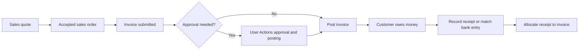
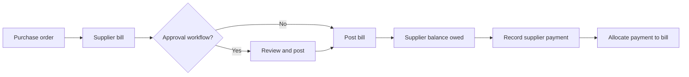
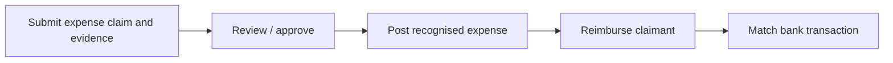
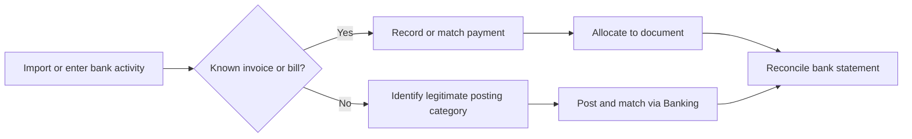
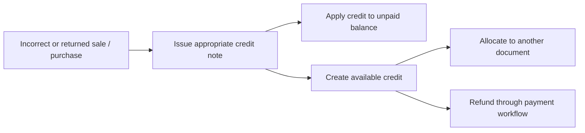
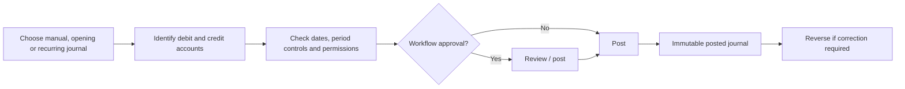
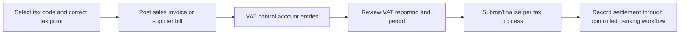

# LedgerOne: accounting workflows for non-accountants

Use the business screen that describes what happened. LedgerOne creates balanced journal entries and preserves supporting records. **Do not post directly to control accounts (trade receivables, trade payables, VAT or linked bank accounts) to simulate a sale, purchase or payment.**

## Sales: quote → order → invoice → receipt

**Where:** Sales → Quotes / Orders / Invoices / Customer payments. A quote/order records commercial intent; it is not an accounting journal. When posted, a typical invoice **debits receivables** (amount due) and **credits sales income** (and VAT payable when applicable). A payment typically **debits bank** and **credits receivables**. Allocation connects the payment with an invoice and determines the outstanding amount; it does not invent a second payment.

## Purchases: purchase order → supplier bill → payment

**Where:** Purchases → Purchase Orders, Bills, Supplier Payments. Purchase orders are commitments, not automatically ledger expenses. A posted bill generally **debits expense or asset** (and recoverable input VAT if appropriate) and **credits payables**. Paying it **debits payables** and **credits bank**. Use the correct supplier bill rather than a manual journal to settle trade payables.

## Expense claims and reimbursement

**Where:** Expenses / User Actions (when the Expenses module is enabled). Typically **debit expense** and **credit the amount owed to claimant** when recognised, then **debit that liability** and **credit bank** when reimbursed. Exact postings follow the configured module workflow; attach receipts and do not bypass required approval.

## Bank money in, money out, and transfers

**Where:** Banking → Reconcile / Statement reconciliations. A bank receipt commonly **debits bank**; an outgoing payment **credits bank**, with the opposite entry determined by the underlying event. A transfer between two owned bank accounts **debits destination bank and credits source bank** and is not income or expenditure. Avoid treating duplicate imported transaction rows as additional accounting postings. Formal reconciliation is a separate check that statement balances and the ledger agree.

## Credit notes, corrections, and refunds

**Where:** Sales / Purchases → Credit Notes, Refunds & Credits. Credit notes reverse or reduce the original invoice/bill accounting effect, including applicable tax. If the original document was already paid, a credit may become unapplied credit to allocate elsewhere or refund; a refund is an actual bank movement. Posted documents are immutable: correct with credits/reversals rather than editing journal totals.

## Journals, opening balances, and recurring entries

**Where:** Ledger → Journals / Opening Balances / Recurring Journals. Every posted journal must balance: total debits equal total credits. Use manual journals for adjustments that do not belong to an existing sales, purchases, banking or tax workflow. Opening balances establish starting positions; recurring journals repeat scheduled entries under period controls. A reversal creates a new counter-entry and preserves the original audit trail.

## VAT and tax

**Where:** Sales / Purchases / Tax. A sales invoice usually **credits output VAT liability**; a purchase bill may **debit input VAT recoverable**. Use valid VAT codes and the true tax point. VAT return filing and settlement use the supported tax workflow and period locks; never manually change VAT control balances to make a return agree without an authorised correction.

## Quick decision guide

- **Customer owes money?** Create/post a sales invoice, then record and allocate their payment.
- **You owe a supplier?** Enter/post a purchase bill, then pay and allocate.
- **Employee needs reimbursement?** Use the expense claim and approval workflow where enabled.
- **Bank statement needs matching?** Use Banking reconciliation; avoid recording the receipt twice.
- **Posted amount wrong?** Use a credit note, refund or authorised journal reversal, as appropriate.
- **Starting a new ledger?** Use Opening Balances.
- **Repeating legitimate accrual/adjustment?** Use Recurring Journals.
- **VAT correction?** Follow Tax period policy and approved adjustment controls.

**Important:** The availability of individual actions depends on enabled modules, roles, organisation configuration and approval policies. Follow LedgerOne's permissions, accounting period and maker/checker controls. The diagrams explain workflows, not a substitute for your organisation's accounting policy or professional tax advice.
