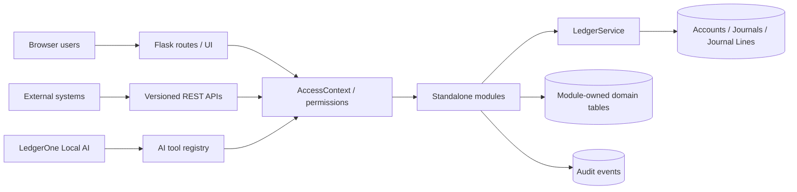

# LedgerOne Architecture

LedgerOne is designed as a modular accounting platform that can run as a personal/home ledger, a small-business or apprentice accounting system, or a multi-organisation enterprise application without changing the underlying accounting engine.

## Architectural principles

1. **One double-entry ledger**
   - Every financially significant module posts through `LedgerService`.
   - Modules do not create their own parallel accounting truth.
   - A posted journal must balance before it can be committed.

2. **Standalone functional modules**
   - Modules live under `ledgerone/modules/<module_id>/`.
   - Each module owns its routes, API, services, permissions, templates and domain models.
   - The module registry discovers modules automatically at application start.
   - Dependencies are declared in the module manifest rather than hard-coded into the core.

3. **API-first design**
   - Functional APIs are versioned under `/api/v1/<module>/...`.
   - Browser users and API/service identities resolve into the same `AccessContext` permission model.
   - Service keys are stored hashed and can be restricted by organisation and permission.

4. **Trusted local AI without an HTTP back door**
   - The built-in AI receives an internal full-access system context.
   - AI tools invoke the same services used by normal modules and APIs.
   - Tool activity is auditable.
   - An out-of-process local AI can use a dedicated full-access API key when required.

5. **Two interfaces, one data model**
   - Home / Apprentice mode uses simpler wording and layout.
   - Professional mode exposes denser accounting terminology and controls.
   - Switching UI modes never changes the underlying records or accounting behaviour.

## Runtime layers



## Core packages

- `ledgerone/__init__.py` — application factory and extension registration.
- `ledgerone/config.py` — runtime configuration and deployment defaults.
- `ledgerone/extensions.py` — SQLAlchemy, Login, Migrate and CSRF extensions.
- `ledgerone/module_registry.py` — automatic module discovery, manifests and enable/disable state.
- `ledgerone/security.py` — browser/API identity resolution and permission decorators.
- `ledgerone/services/context.py` — common identity/permission context.
- `ledgerone/services/ledger.py` — central accounting service.
- `ledgerone/models/core.py` — users, organisations, memberships, service keys and settings.
- `ledgerone/models/ledger.py` — chart of accounts and double-entry journal model.
- `ledgerone/models/audit.py` — cross-module audit records.

## Current modules

| Module | Purpose | Owns domain data | Posts to ledger |
|---|---|---:|---:|
| Core | Dashboard/system | No | No |
| Auth | Sign-in, organisation/UI switching | Core identity only | No |
| Ledger | Chart of accounts and journals | Ledger kernel | Yes |
| Banking | Bank accounts and imported transactions | Yes | Via ledger services |
| Sales | Customers and sales invoices | Yes | Yes |
| Purchases | Suppliers and purchase bills | Yes | Yes |
| Reports | Financial reporting | No | Read-only |
| AI | Local model, tools and interaction history | Yes | Via approved tools |
| Settings | Organisation, modules and API keys | Core settings only | No |

## Multi-organisation model

Every accounting and business-domain record is scoped to an organisation either directly or through its parent record. A user gains access through a `Membership`. This supports:

- one person with a single home ledger;
- one user managing several personal or business entities;
- multiple users in one organisation;
- future role/permission separation for enterprise use.

Cross-organisation queries must never rely on a client-supplied organisation id alone; they must derive scope from the resolved access context.

## Data persistence and scale

SQLite is the default for development and small/local installations. PostgreSQL is supported by setting `DATABASE_URL`.

Development can use `AUTO_CREATE_SCHEMA=true` for a zero-setup first run. Production defaults to `AUTO_CREATE_SCHEMA=false`; schema changes must be applied with Flask-Migrate/Alembic:

```bash
flask --app run.py db upgrade
```

For larger deployments the web tier can be run behind Gunicorn/Waitress or another WSGI host, with PostgreSQL and reverse-proxy TLS termination.

## Accounting invariants

The accounting kernel should continue to enforce these rules as LedgerOne grows:

- every posted journal has at least two lines;
- total debit equals total credit;
- no line contains both a debit and a credit;
- values cannot be negative at the journal-line debit/credit level;
- referenced accounts belong to the active organisation;
- business modules create their domain document and ledger posting atomically;
- financial history should be reversed/corrected rather than silently rewritten once formal posting/locking is introduced.

## Module boundary rule

A new module may read the ledger through services/reporting interfaces and may request postings through `LedgerService`, but it must not embed its own general-ledger logic. For example, Payroll owns employees/pay runs; Fixed Assets owns assets/depreciation schedules; Inventory owns items/stock movements. Their accounting effect still lands in the common journal tables.

## Security model

- Browser authentication uses Flask-Login sessions.
- Browser form writes are CSRF protected.
- REST APIs accept authenticated browser sessions or `Authorization: Bearer <LedgerOne service key>`.
- API keys are hashed in storage.
- Permissions are checked through `AccessContext`.
- Local AI has a system identity but still uses service/tool boundaries and audit records.
- Production deployments should use TLS, a non-default `SECRET_KEY`, PostgreSQL backups, least-privilege API keys and network restrictions for local AI endpoints.

## Extension targets

The architecture is intentionally prepared for future modules such as Payroll, Fixed Assets, Inventory, Projects/Jobs, VAT/Tax, Expenses, Procurement, Budgeting, Consolidation, Currency/FX, Payments, Credit Control and external ERP/banking connectors.
