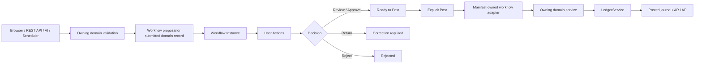

# LedgerOne Workflow Engine and Controlled Posting

## Purpose

LedgerOne's workflow layer separates **preparation, review and approval** from **accounting posting**. Browser users, API clients, AI tools and schedulers may prepare or propose work, but they do not gain a separate route around the accounting kernel.

The core rule is:

> **A channel may propose accounting work; only an explicit User Actions Post operation, delegated to the owning domain service, may create the final accounting effect.**

The workflow engine is not a second ledger. Final journals continue to pass through the owning module and `LedgerService`.

## Architecture



Each workflow-aware module declares its workflow ownership in `ModuleManifest`. The central Workflows module resolves the adapter lazily, so adding a new controlled accounting module does not require adding hard-coded imports or `if/elif` dispatch logic to the workflow controller.

## Current controlled entity types

| Entity type | Owning module | Final domain permission | Accounting effect at Post |
| --- | --- | --- | --- |
| `scheduled_transaction` | Workflows | `ledger.journals.post` | General-ledger journal |
| `journal` | Ledger | `ledger.journals.post` | General-ledger journal |
| `purchase_bill` | Purchases | `purchases.write` | Purchase bill, AP and journal |
| `sales_invoice` | Sales | `sales.write` | Sales invoice, AR and journal |
| `expense_claim` | Expense Claims | `expense_claims.approve` | Approved claim and journal |

All final posting also requires `workflows.post`.

## Proposal boundary

When Workflows is enabled, normal creation channels for manual journals, purchase bills and sales invoices create **workflow proposals**, not posted accounting records. This applies consistently to browser, AI and REST API entry points.

Before a proposal is accepted, LedgerOne performs accounting and domain validation that should not be deferred to a reviewer. This includes, as applicable:

- balanced journal lines;
- valid and active accounts;
- organisation base-currency enforcement;
- control-account protection;
- valid customer or supplier;
- valid VAT/tax-code use and totals;
- due-date rules;
- duplicate/open document-number checks; and
- accounting-period policy, including locked periods.

A request that cannot legally or correctly post should therefore fail **before** a workflow record is created. The same controls are rechecked by the owning service at final Post.

## Workflow concepts

The workflow engine persists:

1. **Workflow Definition** — reusable review/approval rules.
2. **Workflow Instance** — one controlled item and its current state.
3. **User Action** — a review, approval or explicit posting task assigned to a user or role.
4. **Transaction Template** — configuration for recurring money movements.
5. **Scheduled Transaction** — a generated occurrence of a transaction template.

The common statuses include:

```text
draft
awaiting_review
awaiting_approval
ready_to_post
returned
rejected
posted
```

These are workflow states, not journal states.

## User Actions

The **User Actions** page is LedgerOne's common controlled-work inbox. Typical actions are:

- Review;
- Approve;
- Post;
- Return; and
- Reject.

Actions can be assigned to a user or role. Maker/checker separation can prevent an originator from approving their own item where the workflow definition requires independent approval.

## Home / Apprentice and Professional modes

Both UI modes use the same accounting and workflow services.

When no explicit workflow definition applies:

- **Home / Apprentice** proposals can move directly to **Ready to Post**, but still require an explicit Post action.
- **Professional** proposals receive a **Review** action before they become Ready to Post.

An organisation can configure additional approval steps, for example:

```text
Submitted -> Review -> Manager Approval -> Ready to Post -> Explicit Post -> Posted
```

There is no automatic accounting-post path hidden behind the simpler Home UI.

## Domain-specific posting

A User Actions Post does not grant general journal authority to every business module. The owning module's manifest declares the permission required to post its entity.

For example, a purchasing user can post an approved `purchase_bill` with `purchases.write` plus `workflows.post`. The Purchases service then performs its normal AP/journal transaction through `LedgerService`; that user does not receive permission to post arbitrary manual journals.

The current manifest fields are:

```python
workflow_entity_type="purchase_bill"
workflow_adapter="ledgerone.modules.workflows.adapters:PurchaseBillWorkflowAdapter"
workflow_post_permission="purchases.write"
```

The adapter is loaded only when an action for that entity type is handled. It provides the small translation layer between generic User Actions and the owning domain service; it must not duplicate accounting rules.

## Expense Claim return/resubmit behaviour

Expense Claims currently implement the complete correction loop:

```text
Draft -> Submit -> Review -> Return -> Draft/Edit -> Resubmit -> Review -> Post
```

The submitted claim is snapshotted. If underlying claim data changes after review without being formally returned and resubmitted, final posting is blocked.

## Returned Journal/Bill/Invoice proposals

Manual Journal, Purchase Bill and Sales Invoice proposals can currently be returned, but their pending payloads do not yet have a dedicated edit-and-resubmit surface. They must not be treated as fully corrected merely by acknowledging the returned review task.

The intended next control is a **replacement workflow** model: revise and revalidate the proposal, preserve the returned workflow as history, create a new workflow instance and re-run the complete applicable review/approval chain. This prevents a changed amount or coding decision from bypassing a newly applicable approval rule.

## Scheduled transactions

Scheduled transactions support:

- income;
- expense/bill-style direct payments; and
- transfers.

Generation does **not** change the ledger or bank balance. Generated items become workflow work and require explicit Post.

Typical accounting is:

```text
Income:   Dr settlement account / Cr income
Expense:  Dr expense / Cr settlement account
Transfer: Dr destination / Cr source
```

Recurring templates cannot use AR/AP/VAT control accounts as simple category or settlement accounts.

Amount modes are `fixed`, `expected` and `variable`; supported frequencies are weekly, four-weekly, monthly, quarterly and annual.

## API behaviour

The workflow API is under `/api/v1/workflows` and includes templates, generation, definitions, instances and User Actions.

When Workflows is enabled, normal domain creation APIs for journals, purchase bills and sales invoices return a proposal response rather than a posted record. HTTP `201` may be retained for compatibility, but the response explicitly reports that the work is not posted and identifies the workflow instance.

API callers therefore cannot bypass the same User Actions boundary used by browser and AI channels.

## Permissions

The workflow module defines:

```text
workflows.read
workflows.write
workflows.review
workflows.approve
workflows.post
workflows.manage
```

`workflows.post` is necessary but not sufficient. The caller must also hold the owning module's `workflow_post_permission` declared in its manifest.

## Design rule for workflow-aware modules

A new controlled financial module should:

1. validate its proposal using the same business/accounting rules needed for posting;
2. create a workflow instance without creating premature financial effects;
3. declare `workflow_entity_type`, `workflow_adapter` and `workflow_post_permission` in its manifest;
4. let the common engine create review/approval/post User Actions;
5. let its adapter translate the final action into the owning domain service call;
6. revalidate at final posting;
7. route financial effects through `LedgerService`; and
8. test browser, API and AI paths so none can bypass the boundary.

The adapter is orchestration only. The owning service remains authoritative for the business document and accounting transaction.

## Next integrations

The next workflow-control increments are:

1. editable replacement/resubmission for returned Journal, Purchase Bill and Sales Invoice proposals;
2. purchase-order approval workflows;
3. sales/purchase credit-note approval rules;
4. bank-reconciliation exception review;
5. accounting-period reopen/override approval;
6. control-account adjustment approval; and
7. supplier/customer master-data changes such as bank details.

AI-proposed writes should continue to reuse these same domain workflows rather than receiving a separate approval mechanism.
