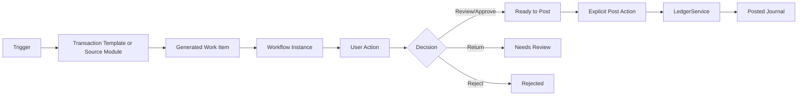

# LedgerOne Workflow Engine and Scheduled Transactions

## Purpose

LedgerOne's workflow layer separates **automation and preparation** from **accounting posting**. It is intended to work from household/personal accounting through professional and enterprise use without creating a second accounting engine.

The core rule is:

> **Automation may create, populate, classify, match and route work. Posting remains an explicit controlled action through the central `LedgerService`.**

For the initial release, scheduled transactions do **not auto-post in either UI mode**. Professional mode adds a review control by default when no explicit workflow rule is configured.

## Architecture



The workflow engine contains five persisted concepts:

1. **Transaction Template** — describes expected recurring money in, bills/expenses or transfers.
2. **Scheduled Transaction** — one generated occurrence of a template.
3. **Workflow Definition** — reusable rules and review/approval steps.
4. **Workflow Instance** — the state of one real item as it passes through controls.
5. **User Action** — a task that a person or role must review, approve, return, reject or explicitly post.

## Scheduled transaction types

The first release supports three generic types.

### Income

Examples: salary, pension, interest, rental income or other recurring receipts.

Accounting when posted:

```text
Dr Payment / deposit account
Cr Income account
```

A salary therefore does not need Accounts Receivable unless there is genuinely an outstanding debtor/customer invoice before payment.

### Expense / bill

Examples: council tax, utilities, broadband, subscriptions, rent and insurance.

Accounting when posted:

```text
Dr Expense account
Cr Payment account
```

This simple workflow intentionally bypasses Accounts Payable where no supplier bill/open creditor is being maintained. A true supplier invoice should continue to use the Purchases/AP workflow.

### Transfer

Examples: current account to savings, repayment of a liability, or loan proceeds.

Accounting when posted:

```text
Dr Destination account
Cr Source account
```

Both accounts must be non-control asset/liability accounts.

## Amount behaviour

Each recurring template has one of three amount modes:

- **Fixed** — the posted amount must equal the configured amount.
- **Expected** — an expected value is stored and the actual amount may vary. An optional tolerance can require re-review before posting if the variance is too large.
- **Variable** — no amount is assumed; the user enters the actual amount at posting time.

Examples:

- Council Tax: Fixed £185 monthly.
- Salary: Expected £2,300 monthly, with actual pay entered when received.
- Electricity: Expected £120 with a tolerance.
- Credit-card payment: Variable monthly amount.

## Frequencies

The initial scheduler supports:

- weekly;
- every four weeks;
- monthly;
- quarterly;
- annually.

Templates have a next-run date and optional end date. Generation is idempotent using a unique template/date combination. Overdue templates can catch up multiple occurrences, with a safety cap to prevent accidental runaway generation.

## Generation versus posting

Generating a due item **does not alter the ledger or the bank balance**.

Due work items can be generated in three ways:

- automatically on the first authenticated app use for the organisation each day;
- manually from **Scheduled Transactions**;
- from the server CLI:

```bash
flask --app run.py generate-recurring-transactions
flask --app run.py generate-recurring-transactions --through-date 2026-10-31
```

The daily generator can be disabled with:

```dotenv
LEDGERONE_WORKFLOW_AUTO_GENERATE_DUE=false
```

Even when automatic generation is enabled, **journal posting remains manual**.

## Home / Apprentice mode

When no explicit workflow definition applies, a Home-originated scheduled item is generated as **Ready to Post** and creates a User Action for explicit confirmation/posting.

This keeps the UI simple while preserving the accounting control boundary.

Example:

```text
Monthly Salary
Expected: £2,300
Due: 1 October
Status: Ready to Post
Action: confirm actual amount and posting date
```

## Professional mode

When no explicit workflow rule applies, a Professional-originated scheduled item receives a **Review** action first.

The sequence is:

```text
Generated -> Awaiting Review -> Ready to Post -> Explicit Post -> Posted
```

There is no automatic posting path in Professional mode.

An organisation can add stronger approval rules so the sequence becomes, for example:

```text
Generated -> Review -> Manager Approval -> Ready to Post -> Explicit Post -> Posted
```

## Workflow definitions

Workflow definitions are reusable and are evaluated by priority. The first release supports rules for:

- entity type;
- recurring transaction type;
- minimum amount;
- maximum amount;
- source-module metadata;
- review required;
- approval required;
- approval role;
- maker/checker separation.

Example:

```text
Name: High-value expense approval
Entity: Scheduled transaction
Transaction type: Expense
Minimum: £1,000
Steps:
  1. Review
  2. Manager approval
Maker/checker: enabled
```

When maker/checker is enabled, the originating user cannot approve their own item.

## User Actions

The **User Actions** page is the common accounting/workflow inbox. It answers:

> What does LedgerOne need me to do?

The initial action types are:

- Review;
- Approve;
- Post;
- Return;
- Reject.

Actions can be assigned to a user or role. The header displays the number of open actions visible to the current user.

The model is intentionally generic so future modules can create actions such as:

- supplier bill approval;
- journal approval;
- bank reconciliation review;
- period-reopen approval;
- new supplier/bank-detail approval;
- AI-generated transaction review;
- control-account adjustment approval.

## Posting controls

Posting a scheduled item requires both:

- `workflows.post`; and
- `ledger.journals.post`.

The posting operation then calls the standard `LedgerService.post_journal()` method. Existing accounting controls therefore continue to apply, including:

- base-currency enforcement;
- accounting-period policy;
- control-account protection;
- journal balancing;
- audit attribution;
- immutable posted journals.

Recurring templates cannot use AR/AP/VAT control accounts as simple payment/category accounts.

## Permissions

The workflow module defines:

```text
workflows.read
workflows.write
workflows.review
workflows.approve
workflows.post
workflows.manage
```

`workflows.post` does not replace the accounting permission. A user must also hold the underlying ledger posting permission.

## API

The initial API is under `/api/v1/workflows`:

```text
GET  /templates
POST /templates
POST /generate-due
GET  /items
GET  /definitions
POST /definitions
GET  /instances
POST /instances
GET  /actions
POST /actions/<id>/decision
POST /actions/<id>/post
```

The generic instance endpoint allows other LedgerOne modules to adopt the workflow framework without coupling their domain data to recurring transactions.

## Status model

Typical workflow states are:

```text
draft
awaiting_review
awaiting_approval
ready_to_post
returned
rejected
posted
```

The long-term platform model may add `needs_information`, `cancelled`, `failed`, escalation and delegation states, but these should remain workflow states rather than accounting journal states.

## Future integrations

The first release establishes the common workflow engine and uses it end-to-end for scheduled transactions. The next integrations should reuse the same engine rather than adding module-specific approval queues:

1. Purchase bills and purchase orders.
2. Expense claims.
3. Manual journals and control-account adjustments.
4. Sales exceptions/credits where approval is required.
5. Bank reconciliation and unusual bank matches.
6. AI-proposed accounting writes.
7. Master-data changes such as supplier bank details.

Bank matching should be able to suggest or complete the **review/match** step, but it should not bypass configured approvals or explicit Professional-mode posting.

## Design rule for new modules

A module that needs approval should:

1. create and own its domain record;
2. call `WorkflowService.start()` with the record type/id, amount and metadata;
3. allow the workflow engine to create User Actions;
4. react to the final approved/ready state through its own controlled service;
5. route financial effects through `LedgerService`.

The workflow engine must never become a second ledger and must never bypass the owning module's accounting/business rules.
